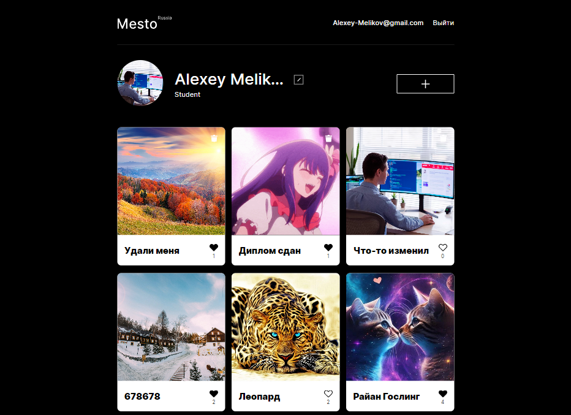

# Проектная работа "Mesto-React-auth"

## 

---

## Технологии

## Функциональность

Внутри сайта пользователь имеет возможность при нажатии на картинку смотреть её в полном разрешении.Код написан с приминением объектно-ориентированного программирования.
Проект написан с помощью функциональных компонентов, настроена работа попапов, работа с api, использован декларативный подход.Добавлена регистрация и авторизация. Все формы на страницу валидируються при помощи react-hook-form.На мобильную версию добавлен бургер(меню с информацией о пользователе).Проект подключён к серверу Github-pages

---

- Адаптивная верстка с использованием медиа-запросов
- Работа по макету Figma
- Объектно-ориентированное программирование
- flex-box / Grid верстка
- Работа с Api
- проект собран с помощью React
- Реализована валидация форм

---

### [Ссылка проекта на GitHub](https://alexey-melikov.github.io/react-mesto-auth/)

## Для запуска проекта

- Склонировать проект на ваш компьютер с [GitHub](https://github.com/Alexey-Melikov/react-mesto-auth)
- Установить зависимости `npm ci`
- Запустить проект `npm start`
- Сборка проекта в продакшн `npm run build`
